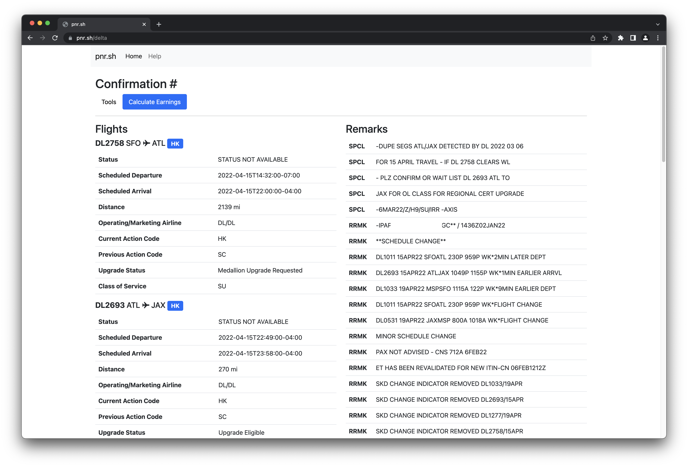

## pnr.sh
[pnr.sh](https://pnr.sh) is a tool for viewing hidden metadata on airline reservations, written in Go. It is fast and lightweight, stores no data, and displays useful data that would otherwise not be visible.

pnr.sh uses normal and public APIs to obtain reservation information that is already sent to mobile phones by the airline carrier during normal use of their mobile applications.

| Airline                 | Supported | Notes                                                    |
|-------------------------|-----------|----------------------------------------------------------|
| Aeromexico              | ✅         | Provides most useful PNR data.                          |
| Delta Air Lines         | ✅         | Provides most useful PNR data.                          |
| United                  | ✅         | Provides only some PNR data.                            |
| Virgin Atlantic         | ✅         | Provides most useful PNR data.                          |
| Others                  | ❌         | Not yet!                                                |

pnr.sh is open-source and freely licensed under the MIT license.